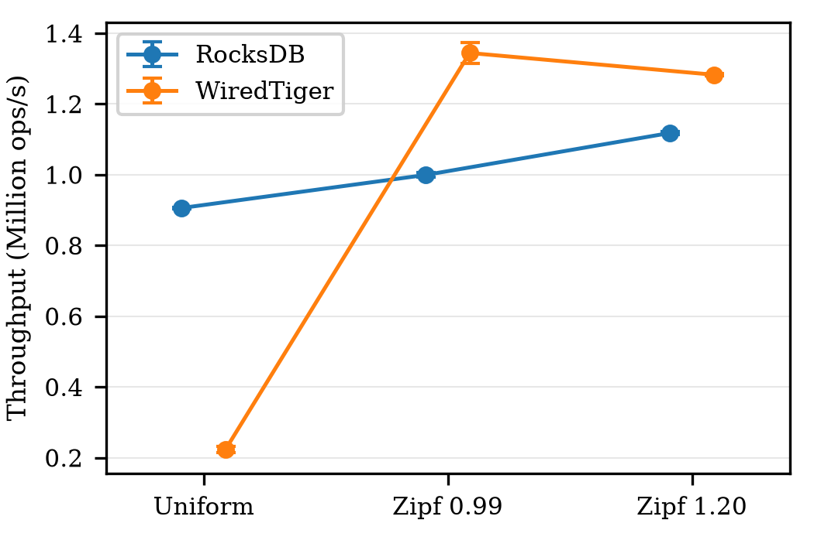
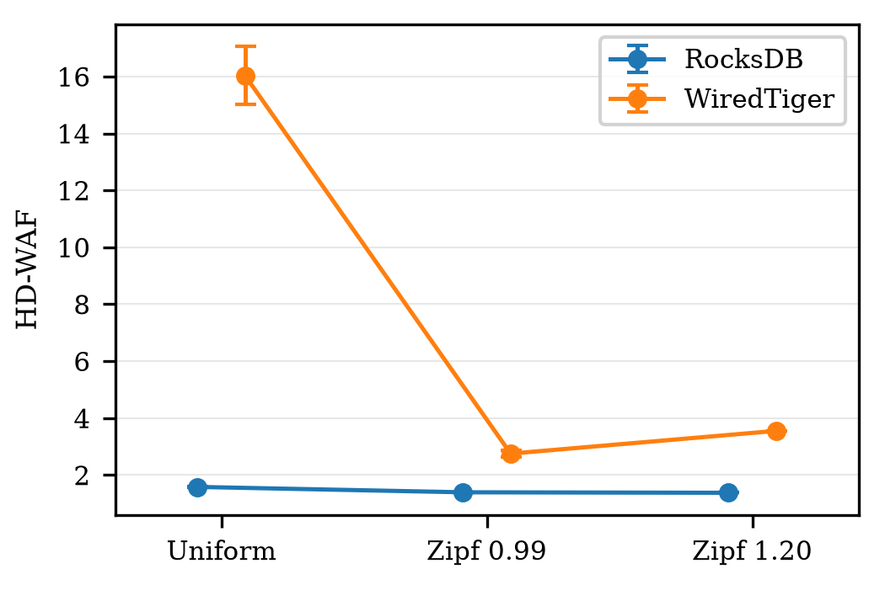
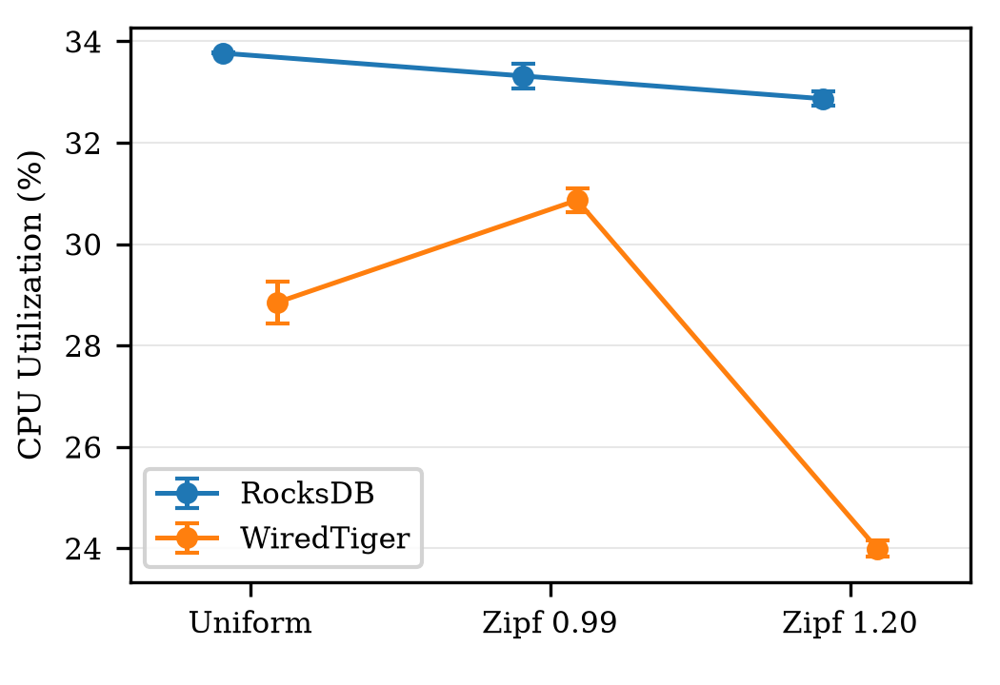
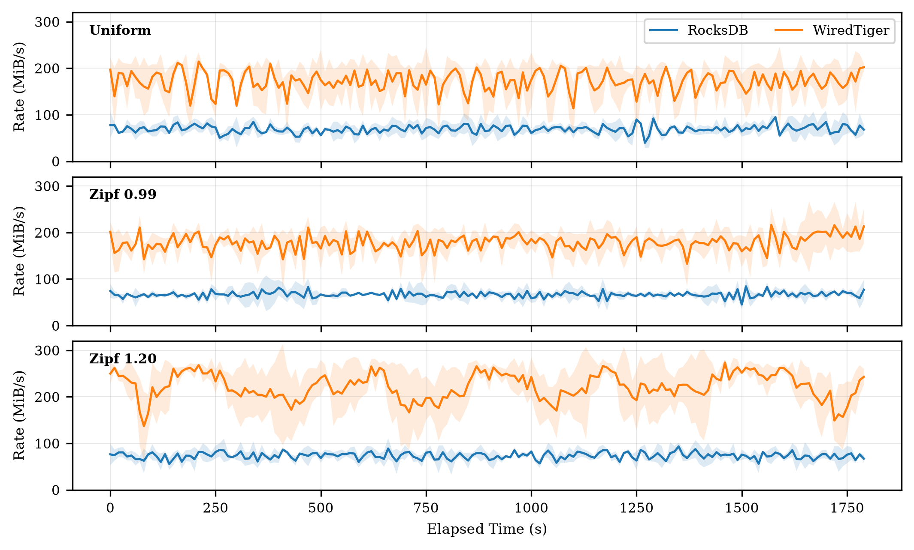

# RocksDB vs WiredTiger NVMe Benchmark

This repository contains the experimental code and benchmark harness for the paper **"An Empirical Characterization of Workload Skew and Host-to-Device Write Amplification in RocksDB and WiredTiger"**. It replaces the engine-native `db_bench`/`wtperf` workload generators with one common C++ workload harness so both engines receive the exact same keyspace, value size, read/update ratio, thread count, seed, and per-thread deterministic operation stream.

## Repository Navigation
* **`scripts/setup_env.sh`**: CachyOS/Arch dependency setup.
* **`scripts/build_engines.sh`**: Check out pinned engine releases and build the benchmark binaries.
* **`scripts/run_suite.py`**: Pilot or final experiment orchestration.
* **`scripts/telemetry_daemon.py`**: Out-of-band NVMe SMART polling.
* **`scripts/parse_and_plot.py`**: Result parsing and figures.
* **`src/benchmark.cpp`**: Common C++ workload harness.
* **`CMakeLists.txt`**: Builds the RocksDB and WiredTiger benchmark executables.

## Workload Controls

* **Keys**: 500,000.
* **Value size**: 100 bytes.
* **Threads**: 4.
* **Read/update mix**: 50/50.
* **Cache budget**: 512 MiB per engine.
* **Compression**: Disabled for both engines.
* **WiredTiger logging**: Enabled.
* **WiredTiger checkpoint interval**: 15 s.
* **Skews**: alpha = 0, 0.99, 1.20.
* **Fixed seed**: 20260927.

The timed phase excludes initial population. Each fresh database is populated with the same 500,000 fixed-width string keys and 100-byte values. RocksDB is flushed and compacted before timing; WiredTiger is checkpointed before timing.

## Execution Instructions

1. **Navigate to the working directory**:
```bash
cd rocksdb-vs-wiredtiger-benchmark
```

2. **Install dependencies**:
```bash
scripts/setup_env.sh
```

3. **Identify your NVMe SSD**:
```bash
sudo nvme list
```

4. **Set environment variables** (Update `/dev/nvme1n1` and the data root path as appropriate for your machine):
```bash
export NVME_DEVICE=/dev/nvme1n1
export BENCH_DATA_ROOT=/home/user/Desktop/final-test
```

5. **Build the engines and benchmark binaries**:
```bash
scripts/build_engines.sh
```

6. **Run the desired benchmark suite**:
*Smoke Test (Short verification)*:
```bash
systemd-inhibit --what=idle:sleep:handle-suspend-key \
  --why="Running benchmark" \
  sudo -E python3 scripts/run_suite.py \
  --mode final \
  --warmup 5 \
  --duration 60 \
  --trials 1
```

*Final Test (Full measurement windows)*:
```bash
systemd-inhibit --what=idle:sleep:handle-suspend-key \
  --why="Running benchmark" \
  sudo -E python3 scripts/run_suite.py \
  --mode final \
  --duration 1800 \
  --trials 3
```

## Experimental Results

| Throughput | HD-WAF | CPU Utilization |
| :---: | :---: | :---: |
|  |  |  |

<p align="center">
  
</p>
